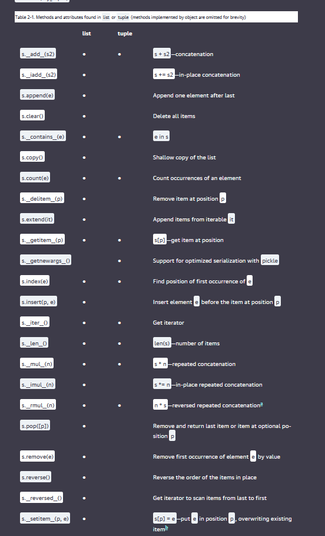

https://learning.oreilly.com/library/view/fluent-python-2nd/9781492056348/ch02.html 

    List comprehensions and the basics of generator expressions

    Using tuples as records versus using tuples as immutable lists

    Sequence unpacking and sequence patterns

    Reading from slices and writing to slices

    Specialized sequence types, like arrays and queues

    
Mutable sequences

    For example, list, bytearray, array.array, and collections.deque.
Immutable sequences

    For example, tuple, str, and bytes.

To initialize tuples, arrays, and other types of sequences, you could also start from a listcomp, but a genexp (generator expression) saves memory because it yields items one by one using the iterator protocol instead of building a whole list just to feed another constructor.

But often, there’s no need to go through the trouble of creating a class just to name the fields, especially if you leverage unpacking and avoid using indexes to access the fields. In Example 2-7, we assigned ('Tokyo', 2003, 32_450, 0.66, 8014) to city, year, pop, chg, area in a single statement. Then, the % operator assigned each item in the passport tuple to the corresponding slot in the format string in the print argument. Those are two examples of tuple unpacking.

Words :
For brevity, many Python programmers refer to list comprehensions as listcomps, and generator expressions as genexps. I will use these words as well.

Code:
https://github.com/fluentpython/example-code-2e/blob/master/02-array-seq/listcomp_speed.py 

To read :
https://www.fluentpython.com/extra/ordered-sequences-with-bisect/

Be careful : However, be aware that the immutability of a tuple only applies to the references contained in it. References in a tuple cannot be deleted or replaced. But if one of those references points to a mutable object, and that object is changed, then the value of the tuple changes. The next snippet illustrates this point by creating two tuples—a and b—which are initially equal. Figure 2-4 represents the initial layout of the b tuple in memory.

Tuples with mutable items can be a source of bugs. As we’ll see in “What Is Hashable”, an object is only hashable if its value cannot ever change. An unhashable tuple cannot be inserted as a dict key, or a set element.

Performance : 

    A tuple uses less memory than a list of the same length, and it allows Python to do some optimizations.

https://stackoverflow.com/questions/68630/are-tuples-more-efficient-than-lists-in-python/22140115#22140115

To evaluate a tuple literal, the Python compiler generates bytecode for a tuple constant in one operation; but for a list literal, the generated bytecode pushes each element as a separate constant to the data stack, and then builds the list.

Given a tuple t, tuple(t) simply returns a reference to the same t. There’s no need to copy. In contrast, given a list l, the list(l) constructor must create a new copy of l.

Because of its fixed length, a tuple instance is allocated the exact memory space it needs. Instances of list, on the other hand, are allocated with room to spare, to amortize the cost of future appends.

The references to the items in a tuple are stored in an array in the tuple struct, while a list holds a pointer to an array of references stored elsewhere. The indirection is necessary because when a list grows beyond the space currently allocated, Python needs to reallocate the array of references to make room. The extra indirection makes CPU caches less effective.

vs

