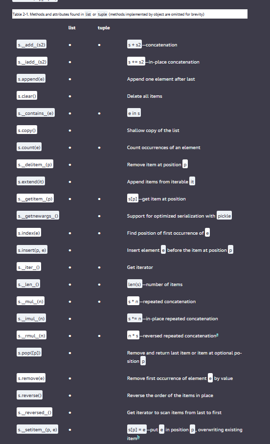

# Fluent Python Chapter 2 Notes: Arrays, Sequences, and Listcomps

---

## List Comprehensions and Generator Expressions

- **List comprehensions (listcomps)** build lists in a single, readable line.
- **Generator expressions (genexps)** produce items one by one, saving memory.
  - Useful when feeding a constructor (e.g., `tuple`, `array`) without building a temporary list.

```python
# List comprehension
listcomp = [x*x for x in range(10)]

# Generator expression
genexp = (x*x for x in range(10))
```

- **Memory Efficiency:** Genexps are preferable when the full list is not needed immediately.

---

## Tuples: Records vs Immutable Lists

- **Tuples as Records:**
  - Structured, heterogeneous data (fields of different types).
  - Example of unpacking:

    ```python
    city, year, pop, chg, area = ('Tokyo', 2003, 32_450, 0.66, 8014)
    ```

- **Tuples as Immutable Lists:**
  - Homogeneous collections where immutability is desired.

> **Important:** Tuples are immutable in terms of their references, not the objects themselves. A mutable object inside a tuple can still be modified.

---

## Sequence Unpacking and Patterns

- **Unpacking** allows assigning multiple variables in one statement.
- Useful for readability and avoiding index-based access.

```python
passport = ('USA', '31195855', 'John Doe')
country, passport_number, name = passport
```

- **Extended unpacking** (Python 3.x):

```python
head, *body, tail = range(5)
```

---

## Slicing: Reading and Writing

- Slices can extract or replace parts of mutable sequences.
- Syntax: `sequence[start:stop:step]`
- **Assignment to slices** changes parts of lists:

```python
l = [0, 1, 2, 3, 4, 5]
l[2:5] = [20, 30]
# Result: [0, 1, 20, 30, 5]
```

---

## Specialized Sequence Types

- **Arrays** (`array.array`) for numeric data.
- **Deques** (`collections.deque`) for fast appends/pops from both ends.

### Mutable Sequences:
- `list`
- `bytearray`
- `array.array`
- `collections.deque`

### Immutable Sequences:
- `tuple`
- `str`
- `bytes`

---

## Important Memory Considerations

- **Tuple vs List:**
  - **Tuples use less memory** than lists.
  - **Tuple creation** is a single bytecode operation.
  - **List creation** pushes each item separately and then builds the list.

> Given a tuple `t`, calling `tuple(t)` returns the same reference.  
> Given a list `l`, `list(l)` **copies** the list.

- **Tuple Memory Layout:**
  - Items stored **directly in the tuple struct**.
  - No additional indirection like in lists.
  
- **List Memory Layout:**
  - Points to a **separate array** of references.
  - Allows dynamic resizing but adds indirection, hurting cache performance.




---

## Extra Reading

- [Ordered Sequences with `bisect`](https://www.fluentpython.com/extra/ordered-sequences-with-bisect/)

## Performance Notes

- **Hashability:** Tuples containing mutable objects are **not hashable**.
- **Use Cases:** Prefer tuples for fixed-length, read-only collections.

> An object is **only hashable** if its value cannot ever change.

---

## References

- *Fluent Python, 2nd Edition*, Chapter 2
- [StackOverflow: Are tuples more efficient than lists in Python?](https://stackoverflow.com/questions/68630/are-tuples-more-efficient-than-lists-in-python/22140115#22140115)
- [Fluent Python Example Code](https://github.com/fluentpython/example-code-2e/blob/master/02-array-seq/listcomp_speed.py)
